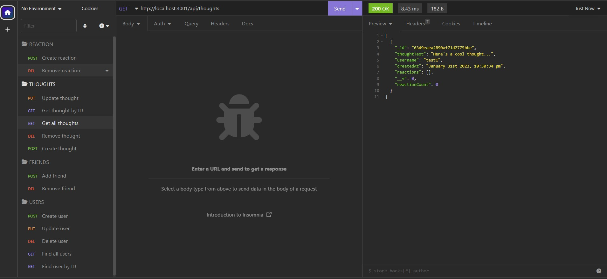

[](https://opensource.org/licenses/MIT)
  
  # Social Network API
  
  ## Project Description
  Create an API for user's social network that use a NoSQL database so the user can handle large amounts of unstructured data

  ## Table of Content

  * [Preview](#preview)

  * [Installation](#installation)

  * [Usage](#usage)

  * [License](#license)

  * [Contributing](#contributing)

  * [Question](#question)

  ## Preview
  [*Demo Video*](https://app.castify.com/view/636c2b7b-a941-4ca9-8e2a-eaf0ad443204)

  *GET User:*

  

  *GET Thoughts:*

  

  ## Installation
  To install the necessary dependencies, run the following commands:
  
  ```
  npm install express
  npm i moment
  npm install mongoose
  ```
  
  ## Usage
  After install the necessary dependencies, run below command in terminal to start the application:

  ```
  node index
  ```

  ## License
  This project is licensed under the 

  [](https://opensource.org/licenses/MIT)
  
  ## Contributing
  N/A
    
  ## Question
  * Connect me on [Github](https://github.com/ykuang321)
  * For any additional questions/information, contact me by Email: **kuangye869@gmail.com**
